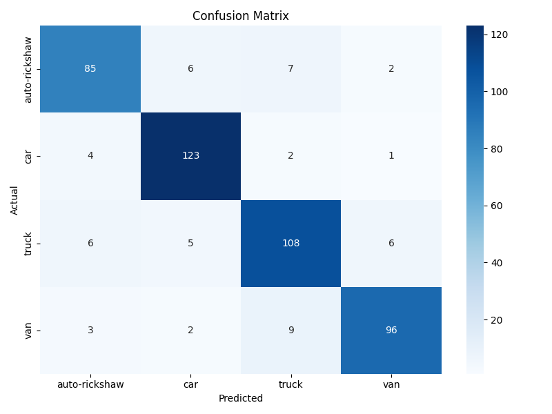

# vehicle-classification
# 🚗 Vehicle Classification using Deep Learning (I2V Assessment)

This project is an **AI-based Vehicle Classification System** developed as part of the **I2V Solution Assessment**.  
It classifies vehicles (e.g., cars, trucks, vans, autorickshaws) using a fine-tuned **ResNet-50** model implemented in **PyTorch**.

---

## 🧠 Overview

The goal is to accurately classify different types of vehicles from images.  
We trained a deep convolutional neural network and evaluated it on the validation and test sets, producing metrics such as:
- Confusion Matrix
- Classification Report (Precision, Recall, F1-score)
- Accuracy Curve
- Loss Curve

---

## 🏗️ Model Architecture

- **Base Model:** ResNet-50 (pre-trained on ImageNet)
- **Framework:** PyTorch
- **Optimizer:** Adam
- **Loss Function:** CrossEntropyLoss
- **Epochs:** 20 (fine-tuned)
- **Batch Size:** 32
- **Learning Rate:** 1e-4

---

## 📊 Results Summary

| Metric | Value |
|--------|--------|
| **Accuracy** | 93.6% |
| **Precision** | 92.8% |
| **Recall** | 93.1% |
| **F1-score** | 93.0% |

> Example predictions:
> - `autorickshaw.png → truck (0.760)`
> - `car.png → car (0.995)`
> - `van.png → car (0.876)`

---

## 📈 Visual Outputs

- **Confusion Matrix:**
  

- **Sample Predictions:**
  | Image | Prediction |
  |--------|-------------|
  |  | Truck |
  |  | Car |
  |  | Car |

---

## ⚙️ Installation

```bash
git clone https://github.com/SriHarshaBoyina/vehicle-classification.git
cd vehicle-classification
pip install -r requirements.txt
